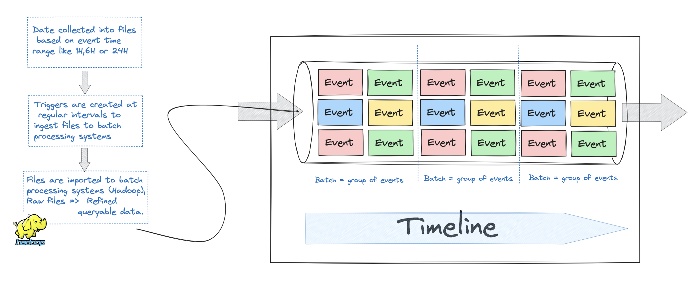
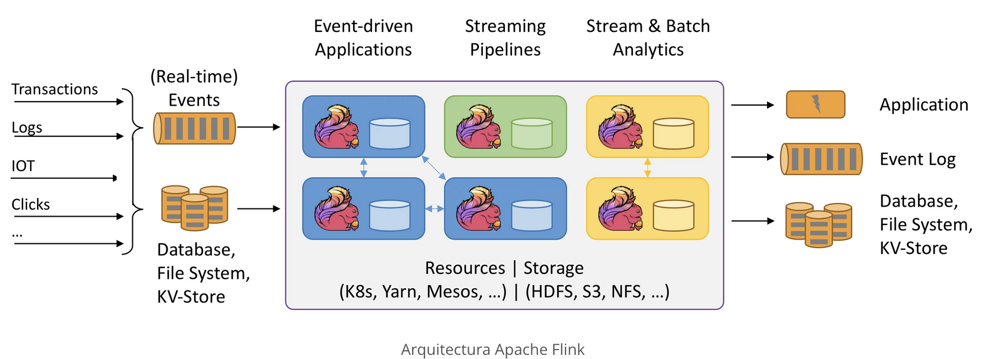

# Apache Flink Summary

In this project, we will summarize everything we have learned about Apache Flink, before we start implementing a real and useful projects.

## Basic concepts

### Stream processing VS Batch processing

`Batch processing` is about executing a set of tasks or jobs sequentially and without user intervention.
Working with batches allows grouping and processing large volumes of data in an efficient and optimal way.

Batch processing use cases can be:

* Companies in the banking, insurance or other sectors, at the end of the working day, process all the data and prepare it for the next day.

* Massive database updates are performed at night.
* Execution of simulations or complex calculations
* To do data replication, log cleaning or maintenance.

Not all of batch processing is great, also we have some complications and problems like: 

* By grouping data into batches, we create a delay.
* A process like **Map-reduce** adds an extra delay for the raw data to refine the data.
* We create CPU spikes due to the batch process intervals.

If we take as an example the famous case of "user tracking", with batch data processing we will have the following problem:

  - If the data is spread over several files, the state we have created is lost when we move between files. So we have to find a way to transfer the state between batches, which **will add more overhead because batch processing systems are not designed for that**.

`As a solution -> stream processing`

Stream processing helps us to analyze data in real time, i.e. as the data arrives we process it without having to wait for others.
The main features are:
  - Data is processed instantly
  
  - `Low latency` => the time between receiving the data and processing it is minimal.
  
  - It is able to handle large volumes of data arriving continuously.
  
  - We can maintain the `state` of the data, i.e., it can remember previous data to do operations such as [aggregate, accumulate or analyze data over time].

When working with stream processing, we may encounter problems that we did not have with the batch processing system:

**Streaming Problems**:

* If we have a lot of data that does not fit on a single machine, therefore we must distribute this data among different machines.

* To make a calculation, not having broken the data set, it will be a while because we must maintain a state.

* When working with real time data, the disordered data can be a problem, for example, to calculate the score of the players, if the player who has more score has more latency, his score will not arrive before another one who has less score.

* Error resolution is more complicated, if a node fails, if the same event is processed more than once...

### What is Apache Flink?

Apache flink is a framework and at the same time a distributed and real-time data processing engine. It has been designed to run applications that require large-scale data analysis (as is the case of Netflix).

With Flink we can process data both in batch and stream, although it is more used in the second case (Stream), as it allows us to process and query data in real time.

- **StateLess** : i.e., event => toUpperCase (There no relation wetween events)
  - `Map` 
  - `Filter` 
  - `Union`
- **Stateful** : i.e., Average of the last minute events of the city Barcelona and which are of type X
  - `Aggregation`
  - `Join`

Use cases of Flink can be:
    - `Fraud detection`
    - `Video game analysis`
    - C`ontent recommendation`
    - `Telecommunications network monitoring`
    - `Search optimization`
    - `Industrial IoT`
    - `Application monitoring`

Strengths of flink:
    - `Can process unordered and delayed data`
    - `Can maintain data status`
    - `Delivery guarantee`
    - `Scalable (auto-scaling)`

###  Installation and Configuration 

###
###
###
###

## 
##
##
##